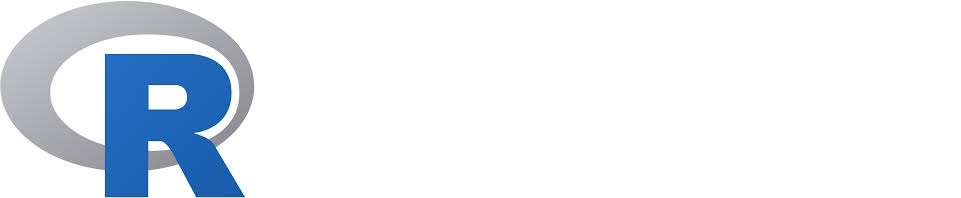

  <a href="www.linkedin.com/in/marcoauréliopedroza/">
      Linkedin</a>

<a href="mailto:marco.aurelio.p@hotmail.com">
 &nbsp; E-mail</a>

# R - Web Scraping - Stock Market :chart_with_downwards_trend: :chart_with_upwards_trend: 

- That project is **about**:
  - Web Scraping;

  - Organizing Data;

  - Handling Data;

  - Creating a excel spreadsheet using R Language.
- **Files**:
  - [Function](./stocksScrapeAsFunction.R) written in R

  - [Excel](./stocks.xlsx) Spreadsheet - Output of the [function](./stocksScrapeAsFunction.R) above

  - [Project](./web_scraping_stocks.Rmd) written in R Markdown

  - [HTML Outcome](http://marcoaureliop.com/stocks/)

- **Packages** I used:
  - Tidyverse;

  - Openxlsx;

  - Rvest;

  - Prettydoc;

  - KableExtra.

- **Outcome**:

