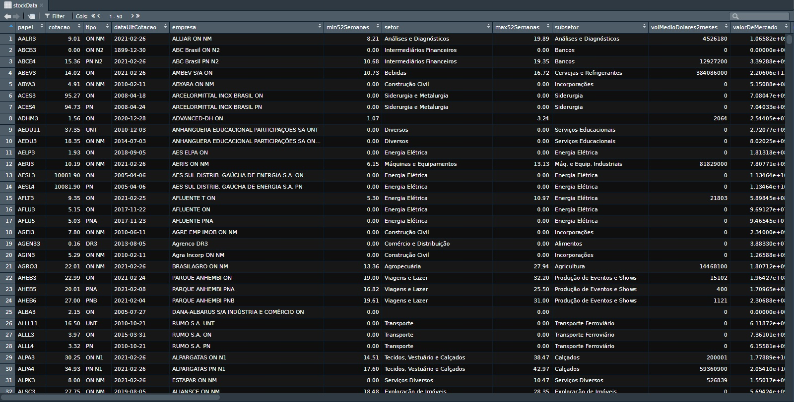

# Coleta de indicadores de ações com R

Projeto de portfólio em R para ler indicadores do [Fundamentus](https://www.fundamentus.com.br/detalhes.php), organizar os dados de cada ação e exportar uma planilha. Refatorei o código original para separar coleta, tratamento e análise. O relatório agora reaproveita a mesma função, sem repetir todo o processamento.



## O que mudou

- Os parâmetros da função passaram a controlar a coleta. É possível consultar alguns tickers ou a lista completa do site.
- Os campos são identificados pelas legendas da página, em vez de posições fixas em um texto longo.
- A demonstração de resultados diferencia empresas financeiras das demais; campos ausentes permanecem como `NA`.
- Números brasileiros e datas são convertidos uma vez, com tipos consistentes.
- Falhas por ticker ficam em `attr(dados, "errors")`. Após cinco falhas seguidas, a coleta para.
- O arquivo R pode ser carregado sem executar a coleta. A exportação usa um caminho escolhido por você.

## Começar

Use uma versão recente do R e instale as dependências:

```r
install.packages(c("rvest", "xml2", "httr", "openxlsx", "rmarkdown", "knitr"))
```

Rode a partir da pasta do repositório:

```r
source("stocksScrapeAsFunction.R")

dados <- scrapeStocks(tickers = c("PETR4", "ITUB4"))
head(dados)
attr(dados, "errors")

write_stock_data(dados, "stocks_atualizados.xlsx")
```

Sem o argumento `tickers`, `scrapeStocks()` consulta a listagem completa. Há uma pausa mínima de um segundo entre páginas; a configuração padrão é de 1,5 segundo. Se uma página não estiver disponível ou mudar de estrutura, o ticker aparece na lista de falhas sem impedir o aproveitamento dos anteriores.

## Relatório

`web_scraping_stocks.Rmd` lê `stockData.RData` por padrão. Esse arquivo, assim como `stocks.xlsx`, é um **resultado histórico do projeto original**. Para renderizar com uma consulta nova:

```r
rmarkdown::render(
  "web_scraping_stocks.Rmd",
  params = list(run_live = TRUE, tickers = c("PETR4", "ITUB4"))
)
```

A versão `web_scraping_stocks.html` também é histórica; ela não é regenerada automaticamente quando o código muda. O arquivo `stockData.html` é outro resultado antigo preservado no repositório.

## Estrutura

| Arquivo | Uso |
| --- | --- |
| `stocksScrapeAsFunction.R` | Coleta, tratamento, exportação e triagem exploratória |
| `web_scraping_stocks.Rmd` | Relatório reproduzível com base histórica ou coleta opcional |
| `tests/test_parser.R` | Testes locais do parser, sem acessar o site |
| `stockData.RData`, `stocks.xlsx` | Saídas históricas |
| `web_scraping_stocks.html`, `stockData.html` | Relatórios históricos |

Para executar os testes: `Rscript tests/test_parser.R`.

A estrutura HTML do Fundamentus pode mudar. O parser foi organizado para apontar esse problema em vez de produzir silenciosamente uma planilha desalinhada. Os percentuais são guardados em pontos percentuais: `7,1%` vira `7.1`. A triagem de dividendos é apenas um filtro dos campos coletados, não uma recomendação de investimento.

[LinkedIn](https://www.linkedin.com/in/marcoaur%C3%A9liopedroza/)

